<div align="center">


# Nova Calendar

**A cosmic calendar of note cards and day cards, under a sky that follows the real moon.**

[](#run-it-locally)
[](#how-it-works)
[](#run-it-locally)
[](#your-data)
[](https://github.com/tuniveza/nova-suite)

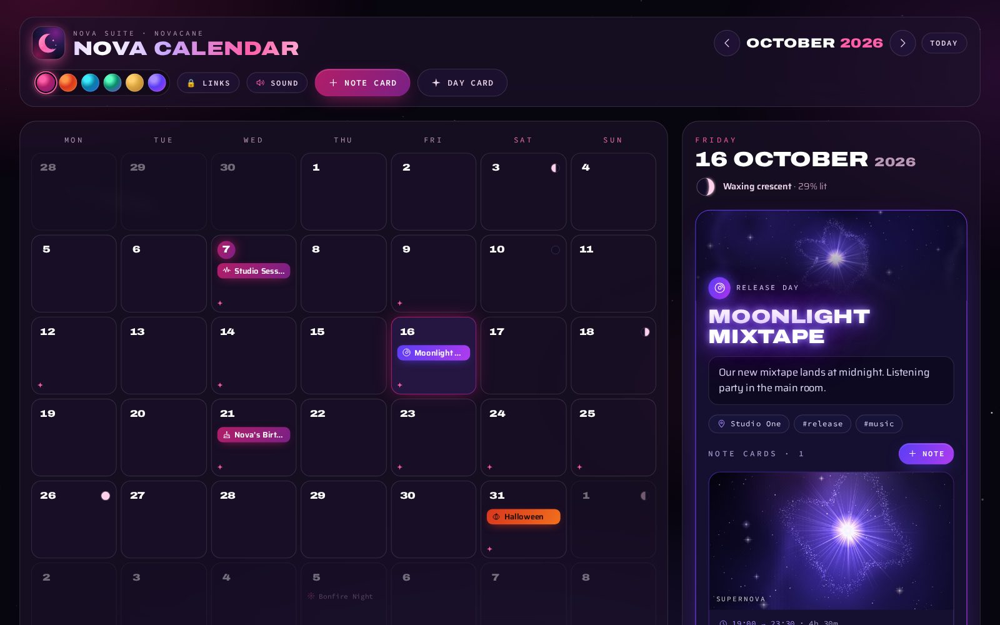

### ✦ [Open Nova Calendar](https://nova-calendar.novacane-studio.workers.dev) ✦

<sub>Works in any modern browser · install it as an app · works offline · built into Nova Agent</sub>

</div>

---

Nova Calendar is the Nova suite's calendar, in Novacane Studios' style. You plan days with
**note cards** and **day cards**: every note paints its own small piece of the cosmos, and every
day sits under the real moon. It's a single folder of HTML, CSS and JavaScript with no build
step, no server and no install.

> **Formerly Nova Task.** Renamed to Nova Calendar in October 2026. Anything saved by the old
> version in the same browser is picked up automatically.

## What's new

| | |
|---|---|
| 🔔 **Sound button** | Soft cosmic sound effects on every press. The **Sound** button in the top bar switches them off and on. |
| 🔒 **Links button** | Opens the password-protected page with every Nova suite address, live and testing. |
| 🪟 **Fit to the window** | Inside Nova Agent, or with `?embed=1`, the whole month and the chosen day fit the space with no scrolling. |
| ✦ **Built into Nova Agent** | Nova Agent serves it at `/calendar/` and it saves to Nova Agent, so the chat and the calendar always agree. |

<p align="center">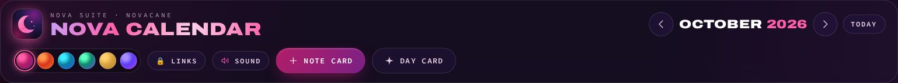</p>

## See it in action

<p align="center">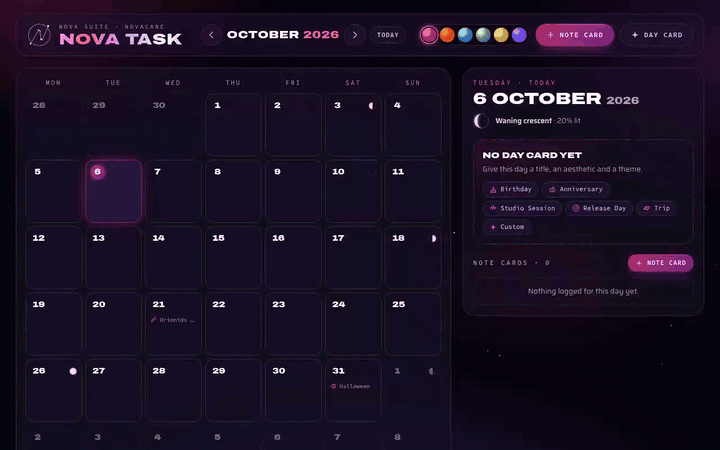</p>

<p align="center"><sub>Pick a day, press <b>Note card</b>, write, save. The picture paints itself from your words.</sub></p>

## What it does

**Note cards**
- A title, the note itself, an author, and a start and finish time. A note can run over several days.
- Saving one stamps it with a log time.
- Each gets its own **generated space picture**, painted from its words while you write. Press
  **Regenerate** to roll a new one and keep it, pick a style (planet, galaxy, star nursery, binary
  stars, comet, black hole, constellation, eclipse, supernova or crescent moon), or **Save image**
  as a 1920×1080 PNG.

**Day cards**
- A title, an aesthetic, a theme, information about the day, a location and tags. Note cards on
  that date appear inside it.
- **Presets** fill in sensible starting values: Birthday, Anniversary, Trip, Studio Session,
  Release Day, Launch, Halloween, Bonfire Night, Christmas, New Year, Valentine's, Pancake Day,
  St Patrick's, Mothering Sunday, Easter, Father's Day, Solstice, Equinox, Meteor Shower, Full
  Moon and Snow Day.
- **Aesthetics** change how the day's name is set and the artwork behind it: Nebula, Supernova,
  Orbit, Constellation, Eclipse, Aurora and Celestial.
- A day card can **repeat every year**, which suits birthdays. It then counts the "orbits round
  the sun" since the first year.

**The real sky**
- Moon phases worked out with Meeus' algorithms, accurate to minutes. Full moons carry their
  traditional names.
- Solstices, equinoxes and the peaks of the major meteor showers.
- UK seasonal days, including Easter-based dates, Mothering Sunday and Bonfire Night. Tap one to
  turn it into a day card.

**Looks and sounds the part**
- **Six themes:** Novacane (magenta), Solar Flare (red-orange), Pulsar (cyan), Aurora (green and
  violet), Eclipse (gold) and Quasar (ultraviolet). A day card can have its own theme.
- **Sound effects** on every press, with a **Sound** button to switch them off (see below).
- **Keyboard:** <kbd>N</kbd> new note card, <kbd>D</kbd> day card, <kbd>T</kbd> today, arrow
  keys move between days, <kbd>PgUp</kbd>/<kbd>PgDn</kbd> change month.

## Screenshots

<table>
  <tr>
    <td width="50%">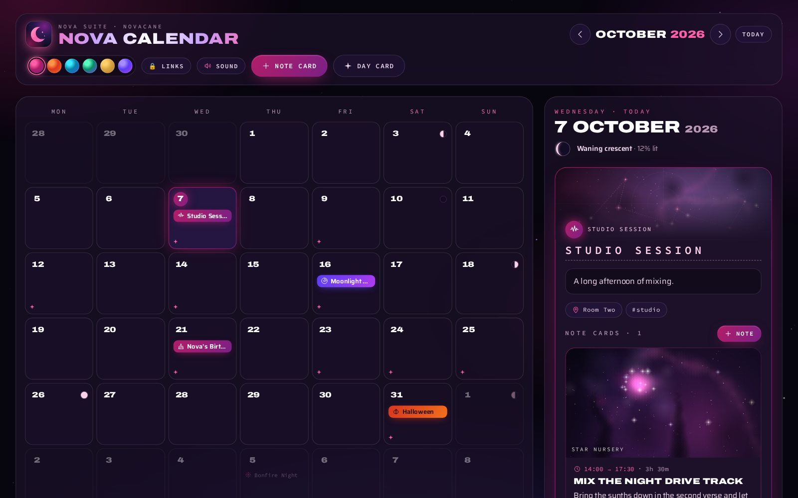<br><sub><b>The month</b>, under the real moon.</sub></td>
    <td width="50%">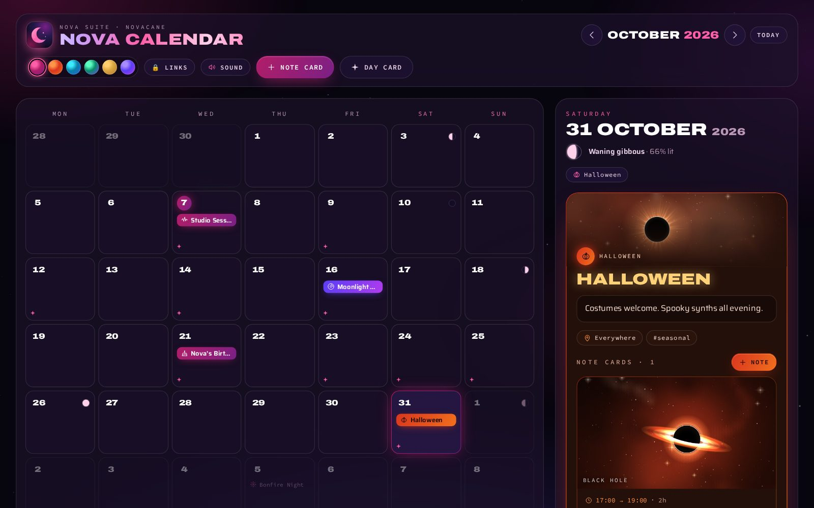<br><sub><b>Halloween</b>, with its own theme.</sub></td>
  </tr>
  <tr>
    <td width="50%">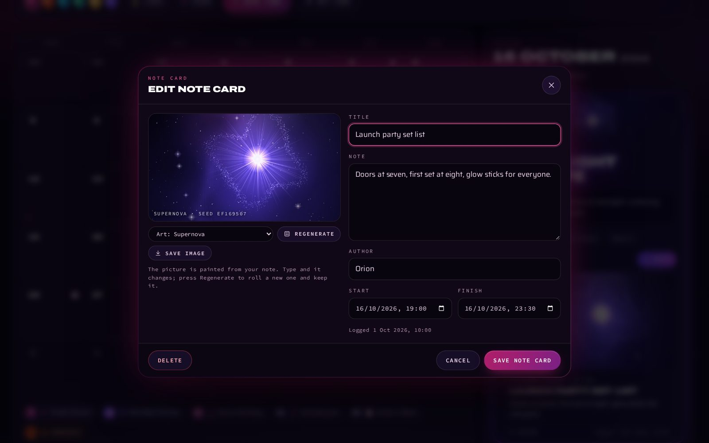<br><sub><b>A note card</b> and the picture it painted.</sub></td>
    <td width="50%">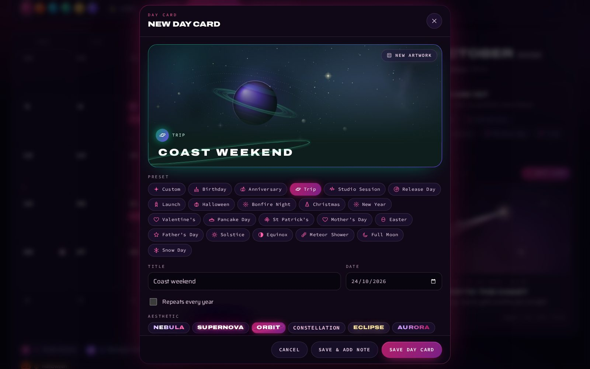<br><sub><b>A day card</b> from the Trip preset.</sub></td>
  </tr>
</table>

<details>
<summary><b>More themes</b></summary>

| | | |
|---|---|---|
| 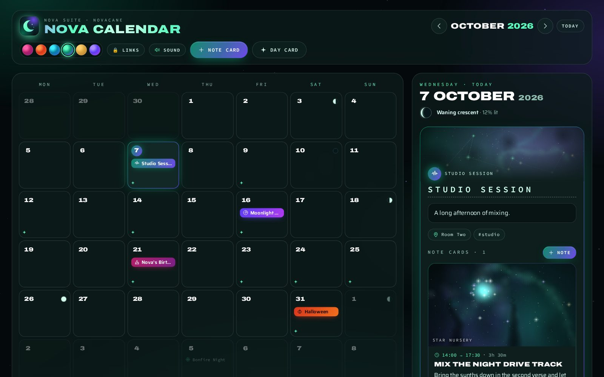 | 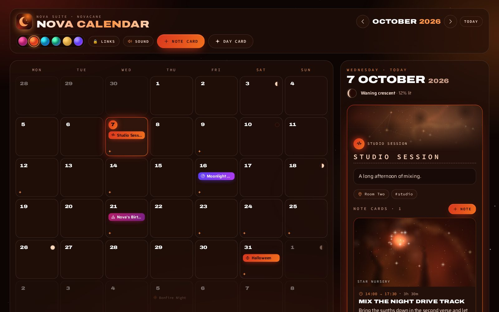 | 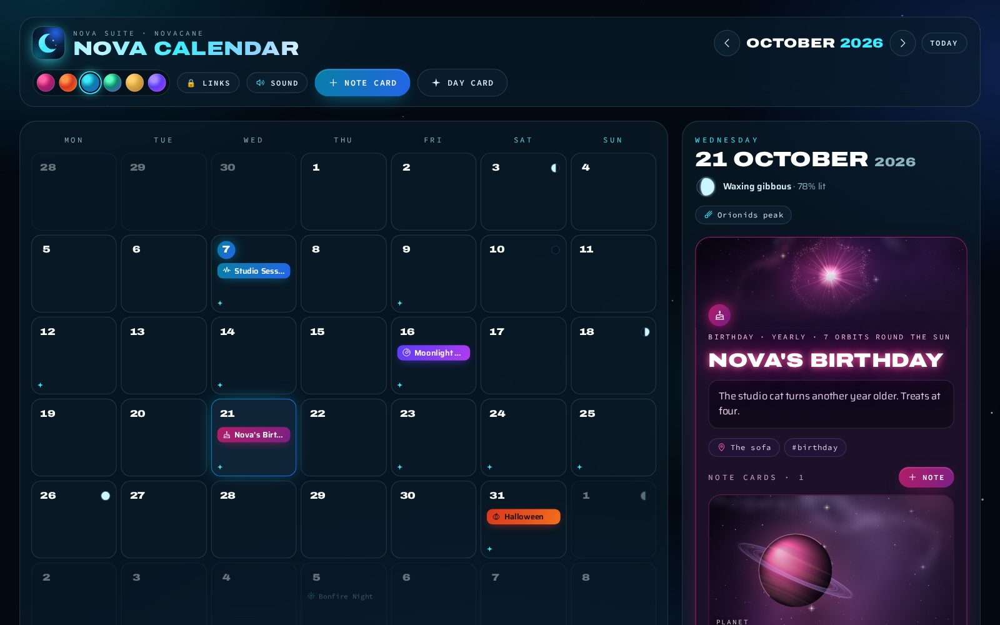 |
| Aurora | Solar Flare | Pulsar (the birthday card keeps its own theme) |

</details>

<sub>Every screenshot uses made-up note cards and day cards.</sub>

## Fit to the window

When Nova Calendar is shown inside another page (Nova Agent's Calendar tab and viewer), or opened
with **`?embed=1`** on the end of its address, it fits the space it's given:

- a slim top bar, and month rows that share the height, so the **whole month** is always in view;
- the **chosen day** beside the month on wide screens, or below it on narrow ones, scrolling on its own;
- the legend, backup buttons, footer, theme swatches, Sound, Links and Install step aside to save room.

| About 900 × 600 | About 430 × 600 |
|---|---|
| 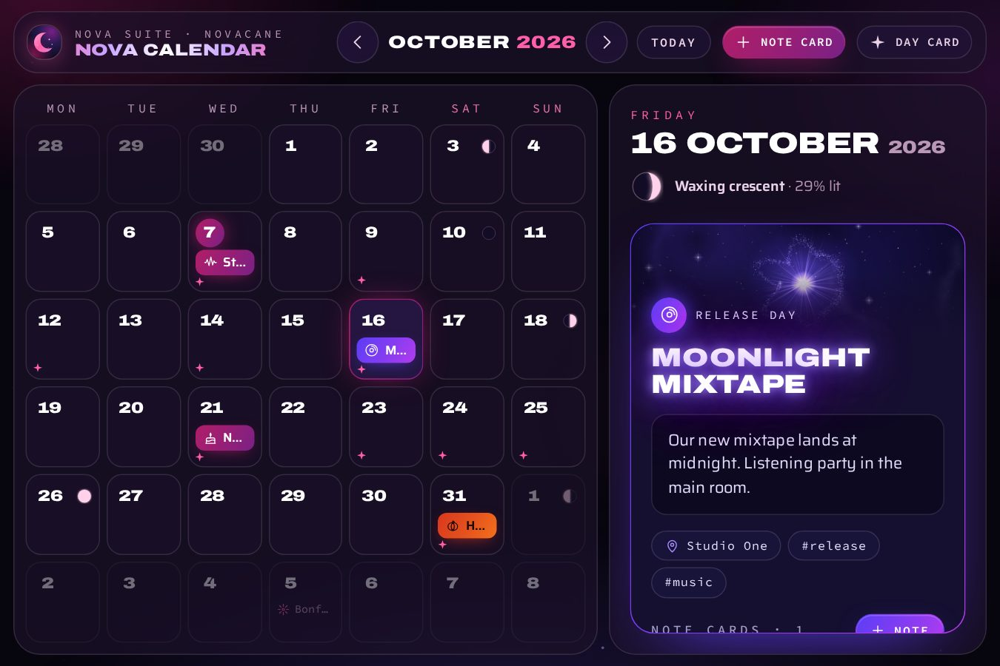 | 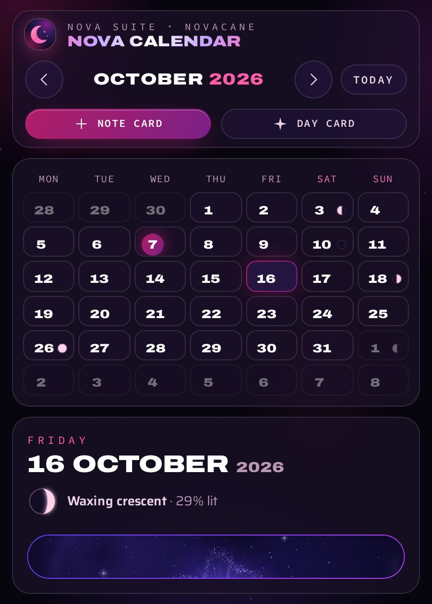 |

## Sound effects

Every press makes a soft cosmic sound: a tap, a dialog opening, a card saving, a card deleting.
They're made live with the Web Audio API (no sound files), tuned to one pentatonic scale and
kept quiet. The **Sound** button in the top bar switches them off and on, plays a little chime
when it does, and is remembered on each device. The same `js/sfx.js` makes the sounds in Nova
Notes and Nova Observatory.

## Inside Nova Agent

[Nova Agent](https://github.com/tuniveza/nova-agent) includes this repo as a git submodule and
serves it at **`/calendar/`**. There it saves to Nova Agent (`data/calendar.json`) instead of
only the browser, so note cards and day cards made by Nova Agent's chat appear on the calendar,
and the page refreshes when Nova Agent changes something. It opens in fit-to-window mode in
Nova Agent's Calendar tab.

## Use it as an app

Open **https://nova-calendar.novacane-studio.workers.dev** and install it from the **Install**
button, the browser's address bar or menu (on iPhone/iPad: **Share → Add to Home Screen**).
Installed, it gets its own window and launcher icon, works offline, and its icon's shortcut
menu (long-press or right-click) opens straight into a **new note card** or **new day card**.

To host your own copy on Cloudflare: `npx wrangler deploy` (see `wrangler.jsonc`; `_headers` sets
the security headers and `.assetsignore` keeps the README and media off the site).

## How it works

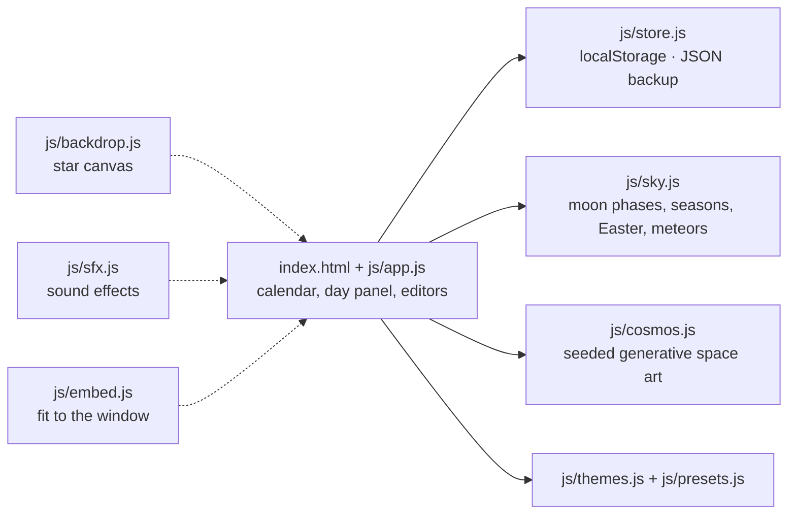

- **Seeded art:** each note's picture comes from a seed (hashed from its words while you type,
  then kept), so the same note always paints the same picture.
- **No dependencies:** plain browser JavaScript and Canvas. The fonts load from Google Fonts;
  without a connection the page falls back to system fonts.

## Run it locally

Open `index.html` in a browser. That's it.

To serve it instead:

```sh
python3 -m http.server 4600   # then open http://localhost:4600
                              # or http://localhost:4600/?embed=1 to see it fit the window
```

## Your data

On the web, everything is saved in this browser's `localStorage` under the key
`nova-calendar/v1` (anything saved before the rename, under `nova-task/v1`, is picked up
automatically); nothing is sent anywhere. Inside Nova Agent, it's saved to Nova Agent on the
studio computer instead.

Use **Export** to download a JSON backup and **Import** to merge one back in. Items with the same
id are replaced by the imported copy. Exported backups (`nova-calendar-backup-*.json`) are
ignored by git, so your own notes don't end up in the repo.

## Configuration

There's nothing to configure and no keys or secrets. To change the look:

| File | Job |
|---|---|
| `js/themes.js` | Colour themes. To add one, copy a block and change the hex codes. |
| `js/presets.js` | Day card presets, the title aesthetics and the line icons. |

## Tests

There's no automated test suite yet. The sky maths in `js/sky.js` follows Meeus' published
algorithms; the quickest check is to compare a few moon phases and solstices against a
published almanac.

## Project layout

| File | Job |
|---|---|
| `index.html` | The page |
| `js/app.js` | The calendar, the day panel, the editors and the Sound button |
| `js/store.js` | Saving, loading, validating, import and export |
| `js/sky.js` | Moon phases, seasons, Easter and the seasonal and meteor dates |
| `js/cosmos.js` | The seeded generative space art |
| `js/presets.js` | Day card presets, title aesthetics and line icons |
| `js/themes.js` | Colour themes |
| `js/backdrop.js` | The twinkling star canvas behind the page |
| `js/sfx.js` | The Nova suite sound effects (shared with Nova Notes and Nova Observatory) |
| `js/embed.js` | Turns on fit-to-window mode inside another page or with `?embed=1` |
| `css/nova.css` | All the styling, including fit-to-window mode |
| `sw.js`, `manifest.webmanifest` | Offline support and install details |
| `assets/` | The app icon and the Nova sigil |
| `docs/media/` | README images |

## Part of the Nova suite

| Project | What it is |
|---|---|
| [nova-suite](https://github.com/tuniveza/nova-suite) | The Nova suite: an overview of every project |
| [nova-bot](https://github.com/tuniveza/nova-bot) | The website chat assistant, booking card and Nova Hub |
| [nova-agent](https://github.com/tuniveza/nova-agent) | The studio computer's helper; Nova Calendar is built in |
| [nova-club](https://github.com/tuniveza/nova-club) | Members' Android app that shows the studio's busy times |
| **[nova-calendar](https://github.com/tuniveza/nova-calendar)** | This repo: a cosmic calendar of note cards and day cards |
| [nova-notes](https://github.com/tuniveza/nova-notes) | A note editor that writes from the centre outwards |
| [nova-observatory](https://github.com/tuniveza/nova-observatory) | A dashboard of every project, with screenshots and video |
| [nova-index](https://github.com/tuniveza/nova-index) | The suite's shared memory |

---

<p align="center"><sub>Made for <b>Novacane Studios</b> · All rights reserved</sub></p>
