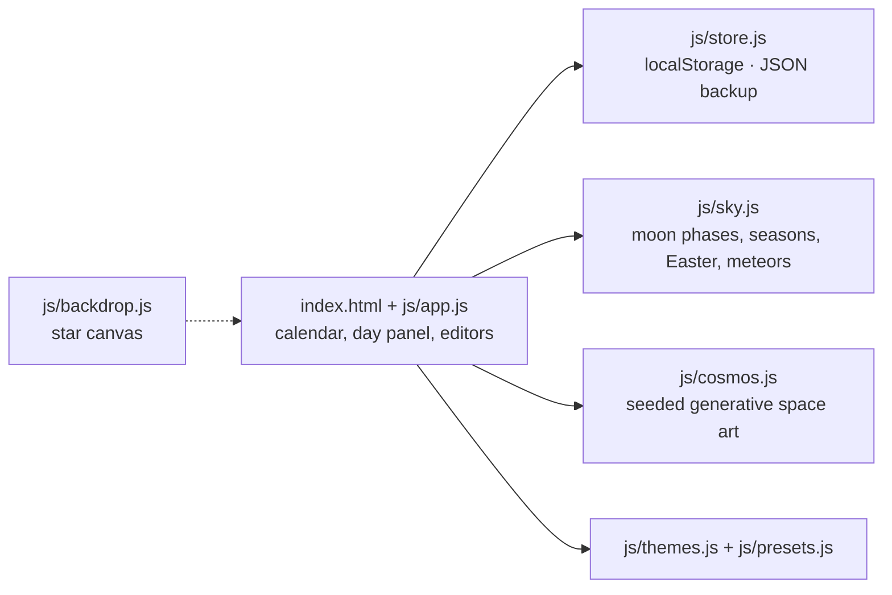

<div align="center">


# Nova Calendar

**A cosmic calendar of note cards and day cards, under a sky that follows the real moon.**

[](#run-it-locally)
[](#how-it-works)
[](#run-it-locally)
[](#data)
[](https://github.com/tuniveza/nova-suite)

### ✦ [Open Nova Calendar](https://nova-calendar.novacane-studio.workers.dev) ✦

<sub>Works in any modern browser · install it as an app · works offline</sub>

</div>

---

Nova Calendar is a calendar from the Nova suite, built in Novacane Studios' style. You plan days
with **note cards** and **day cards**: every note paints its own small piece of the cosmos,
and every day sits under the real moon. It's a single folder of HTML, CSS and JavaScript with
no build step, no server and no install.

> **Formerly Nova Task.** Renamed to Nova Calendar in October 2026. Anything saved by the old
> version in the same browser is picked up automatically.

## Use it as an app

Open **https://nova-calendar.novacane-studio.workers.dev** and install it from the **Install**
button, the browser's address bar or menu (on iPhone/iPad: **Share → Add to Home Screen**).
Installed, it gets its own window and launcher icon, works offline, and its icon's shortcut
menu (long-press or right-click) opens straight into a **new note card** or **new day card**.

To host your own copy on Cloudflare: `npx wrangler deploy` (see `wrangler.jsonc`; `_headers` sets
the security headers and `.assetsignore` keeps the README and media off the site).

## What it does

- **Note cards** have a title, the note itself, an author, and a start and finish time; a note
  can run over several days. Saving one stamps it with a log time. Each note also gets its own
  **generated space picture**:
  - While you write a new note, the picture is painted from its words.
  - Press **Regenerate** to roll a new picture and keep it.
  - Choose a style: planet, galaxy, star nursery, binary stars, comet, black hole,
    constellation, eclipse, supernova or crescent moon.
  - **Save image** exports the picture as a 1920×1080 PNG.
- **Day cards** each have a title, an aesthetic, a theme, information about the day, a location
  and tags.
  - Note cards on that date appear inside the day card.
  - **Presets** fill in sensible starting values: Birthday, Anniversary, Trip, Studio Session,
    Release Day, Launch, Halloween, Bonfire Night, Christmas, New Year, Valentine's, Pancake
    Day, St Patrick's, Mothering Sunday, Easter, Father's Day, Solstice, Equinox, Meteor Shower,
    Full Moon and Snow Day.
  - **Aesthetics** change how the day's name is set and which artwork sits behind it: Nebula,
    Supernova, Orbit, Constellation, Eclipse, Aurora and Celestial.
  - A day card can **repeat every year**, which suits birthdays. It then counts the "orbits
    round the sun" since the first year.
- **The real sky:**
  - Moon phases are worked out with Meeus' algorithms and are accurate to minutes. Full moons
    carry their traditional names.
  - Solstices and equinoxes are shown.
  - UK seasonal days appear automatically, including Easter-based dates, Mothering Sunday and
    Bonfire Night.
  - Peaks of the major meteor showers are marked.
  - Tap a seasonal day to turn it into a day card.
- **Themes:** Novacane (magenta), Solar Flare (red-orange), Pulsar (cyan), Aurora (green and
  violet), Eclipse (gold) and Quasar (ultraviolet). A day card can have a different theme from
  the rest of the app.
- **Keyboard:** <kbd>N</kbd> new note card, <kbd>D</kbd> day card, <kbd>T</kbd> today, arrow
  keys move between days, <kbd>PgUp</kbd>/<kbd>PgDn</kbd> change month.

## Screenshots

<p align="center">
  
</p>

<table>
  <tr>
    <td width="50%"><br><sub>A month under the real moon.</sub></td>
    <td width="50%"><br><sub>Building a day card from a preset.</sub></td>
  </tr>
  <tr>
    <td width="50%"><br><sub>A note card paints its own picture.</sub></td>
    <td width="50%"><br><sub>The Solar Flare theme.</sub></td>
  </tr>
  <tr>
    <td colspan="2" align="center"><br><sub>Halloween, straight from the seasonal sky.</sub></td>
  </tr>
</table>

## How it works



- **Seeded art:** each note's picture comes from a seed (hashed from its words while you type,
  then kept), so the same note always paints the same picture.
- **No dependencies:** plain browser JavaScript and Canvas. The fonts load from Google Fonts;
  without a connection the page falls back to system fonts.

## Run it locally

Open `index.html` in a browser. That's it.

To serve it instead:

```sh
python3 -m http.server 4600   # then open http://localhost:4600
```

## Data

Everything is saved in this browser's `localStorage` under the key `nova-calendar/v1` (anything saved before the rename, under `nova-task/v1`, is picked up automatically); nothing is
sent anywhere. Use **Export** to download a JSON backup and **Import** to merge one back in.
Items with the same id are replaced by the imported copy. Exported backups
(`nova-calendar-backup-*.json`) are ignored by git, so your own notes don't end up in the repo.

## Configuration

There's nothing to configure and no keys or secrets. To change the look:

| File | Job |
|---|---|
| `js/themes.js` | Colour themes. To add one, copy a block and change the hex codes. |
| `js/presets.js` | Day card presets, the title aesthetics and the line icons. |

## Tests

There's no automated test suite yet. The sky maths in `js/sky.js` follows Meeus' published
algorithms; the quickest check is to compare a few moon phases and solstices against a
published almanac.

## Project layout

| File | Job |
|---|---|
| `index.html` | The page |
| `js/app.js` | The calendar, the day panel and the editors |
| `js/store.js` | Saving, loading, validating, import and export |
| `js/sky.js` | Moon phases, seasons, Easter and the seasonal and meteor dates |
| `js/cosmos.js` | The seeded generative space art |
| `js/presets.js` | Day card presets, title aesthetics and line icons |
| `js/themes.js` | Colour themes |
| `js/backdrop.js` | The twinkling star canvas behind the page |
| `css/nova.css` | All the styling |
| `assets/sigil.svg` | The Nova sigil |
| `docs/media/` | README images |

## Part of the Nova suite

| Project | What it is |
|---|---|
| [nova-suite](https://github.com/tuniveza/nova-suite) | The Nova suite: an overview of every project |
| [nova-bot](https://github.com/tuniveza/nova-bot) | The website chat assistant, booking card and Nova Hub |
| [nova-agent](https://github.com/tuniveza/nova-agent) | Browser helper that does jobs in Acuity's admin pages |
| [nova-club](https://github.com/tuniveza/nova-club) | Members' Android app that shows the studio's busy times |
| **[nova-calendar](https://github.com/tuniveza/nova-calendar)** | This repo: a cosmic calendar of note cards and day cards |
| [nova-notes](https://github.com/tuniveza/nova-notes) | Nova Notes (in progress) |
| [nova-observatory](https://github.com/tuniveza/nova-observatory) | A dashboard of every project, with screenshots and video |

## Licence

All rights reserved — Novacane Studios.
